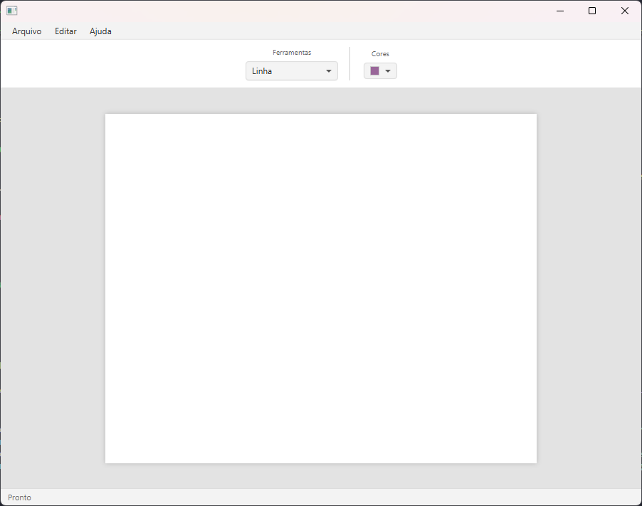
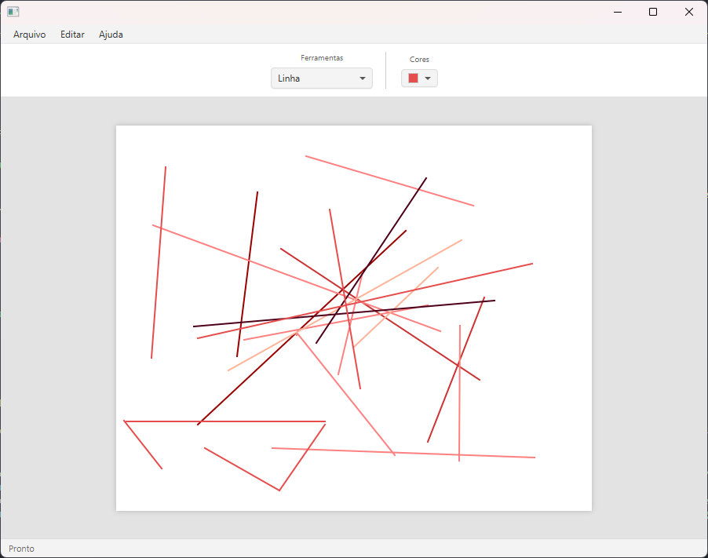
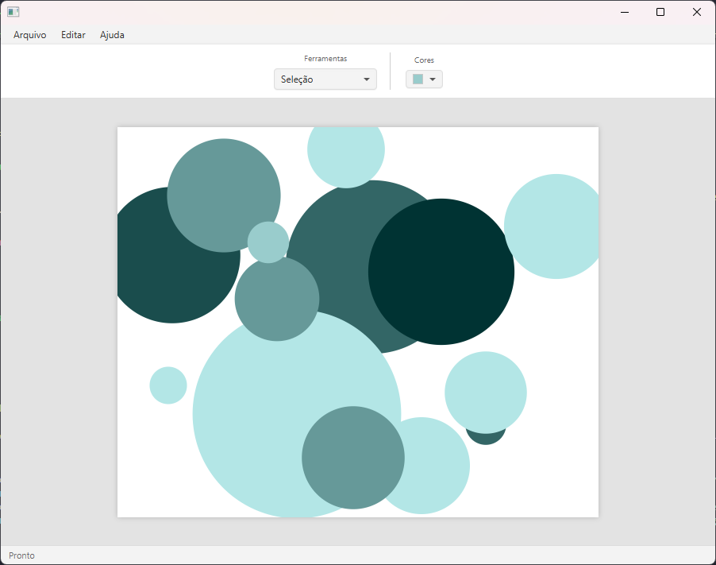
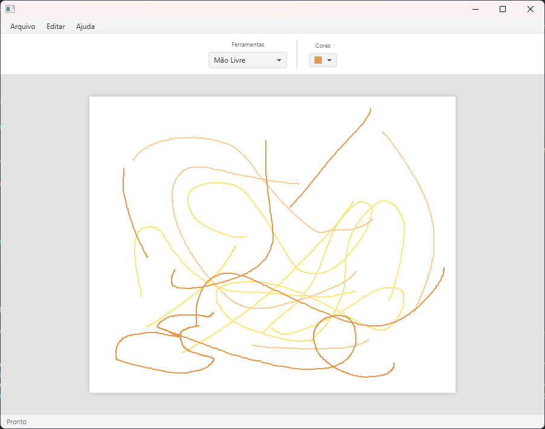
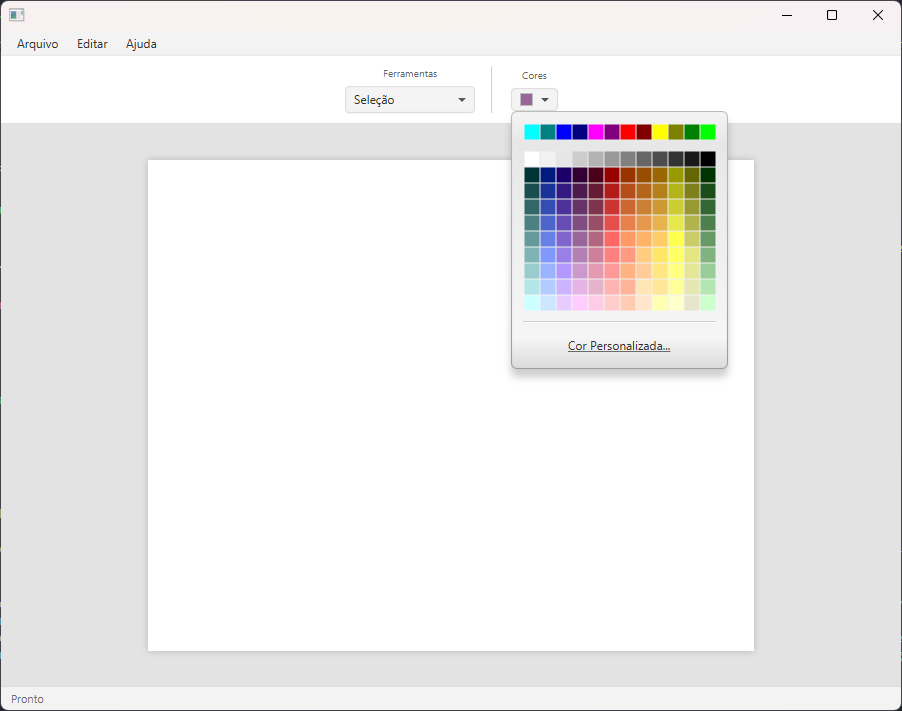

<div align="center">
  
# 🎨🖌️ JavaFX Paint Editor

Um editor de desenhos vetoriais leve e funcional desenvolvido em ***Java*** com **`JavaFX`**. <br>
Este projeto foi construído focando na aplicação correta de padrões de projeto de software, oferecendo uma interface limpa inspirada em editores modernos.

</div>

ㅤ

## 📋 Sobre o Projeto

O objetivo deste projeto é demonstrar a implementação de uma ferramenta gráfica capaz de criar, manipular e organizar formas geométricas. A arquitetura segue estritamente o padrão **MVC (Model-View-Controller)** e utiliza o padrão **State** para o gerenciamento das ferramentas de desenho, garantindo um código extensível e organizado.

---

## 📸 Galeria e Funcionalidades

### Interface Principal
A interface foi desenhada para ser ***simples e intuitiva***, com uma barra de ferramentas centralizada e uma área de desenho (Canvas) destacada com sombreamento.

<p align="center">
  
  
  
</p>
ㅤ

### Ferramentas de Desenho
O programa suporta diversas formas primitivas e desenho livre.

| Linhas | Círculos |
|:---:|:---:|
| Criação de retas com precisão. | Formas elípticas e circulares perfeitas. |
|  |  |

| Retângulos | Mão Livre |
|:---:|:---:|
| Quadrados e retângulos de qualquer dimensão. | Desenho livre para esboços artísticos. |
|  |  |

ㅤ

### Seleção e Cores
É possível selecionar qualquer figura desenhada para manipulá-la, além de alterar a cor das ferramentas ou recolorir objetos existentes.
<p align="center">
  
  
  
</p>

---

## 🛠 Arquitetura e Padrões de Projeto

O projeto destaca-se pelo uso de padrões de engenharia de software:

* **Padrão State:** Cada ferramenta (Linha, Retângulo, Seleção, etc.) é um estado. Isso elimina condicionais complexas (`if/else`) no controle do mouse e facilita a adição de novas ferramentas sem quebrar o código existente.
* **Padrão MVC:**
    * **Model:** Gerencia os dados das figuras (`Line`, `Rectangle`, `Circle`).
    * **View:** Interface definida em FXML (`visaoPaint.fxml`).
    * **Controller:** `PaintController` faz a ponte entre a interface e a lógica de negócios.
* **Polimorfismo:** Todas as formas herdam da classe abstrata `Figura`, permitindo tratamento genérico para desenho e detecção de colisão.

---

## 🎮 Controles e Atalhos

Quando a ferramenta **Seleção** está ativa, você pode interagir com as figuras:

| Ação | Comando / Atalho |
| :--- | :--- |
| **Selecionar** | Clique sobre uma figura |
| **Mover** | Arraste a figura com o mouse |
| **Apagar** | Tecla `DELETE` |
| **Trazer para Frente** | Tecla `SETA PARA CIMA` (↑) |
| **Enviar para Trás** | Tecla `SETA PARA BAIXO` (↓) |
| **Recolorir** | Selecione a figura e mude a cor no ColorPicker |

---

## 🚀 Como Executar

### Pré-requisitos
* Java JDK 11 ou superior.
* Maven.

### Passos
1.  Clone o repositório:
    ```bash
    git clone https://github.com/matt-aranha/Paint_with_JavaFX
    ```
2.  Entre na pasta do projeto:
    ```bash
    cd Paint_with_JavaFX
    ```
3.  Compile e execute via Maven:
    ```bash
    mvn clean compile exec:java -Dexec.mainClass="paint.App"
    ```

---

#### Este program foi desenvolvido, em boa parte, em sala de aula (ao decorrer da disciplina de Programação Orietnada à Objetos) e, em parte, como Projeto Acadêmico Final para demonstrar competência em POO e JavaFX.
